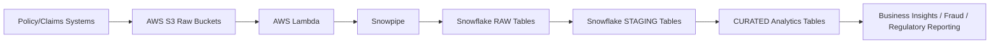

# Insurance Data Engineering Portfolio: Funeral, Life Cover, Retirement Annuity (RA)

> End-to-end step-by-step guide for building an insurance data warehouse using AWS S3, Snowflake, Snowpipe, and Lambda.

This README provides:
1. **Numbered execution steps**
2. **Sample CSV files**
3. **One-page flow diagram**
4. **Full explanations of all SQL scripts**

---

## 🧭 Project Overview

We are building a **long-term insurance platform** with the following products:
- Funeral Insurance
- Life Cover
- Retirement Annuity (RA)

The architecture is:



---

# 📌 Numbered Execution Steps

## **1. Setup AWS S3 Buckets**

1. Login to AWS Console → S3 → Create bucket.
2. Create buckets:
   - `insurance-raw-policies`
   - `insurance-raw-claims`
3. Enable:
   - Block all public access ✅
   - Default encryption: SSE-S3 ✅
4. Upload sample CSV files into each bucket (see section 2).

**Purpose:** Store raw insurance data securely.

---

## **2. Sample CSV Files**

### 2.1 policies.csv
```
policy_id,customer_id,product_type,policy_start_date,policy_end_date,monthly_premium,sum_assured,insured_latitude,insured_longitude
POL001,CUST001,FUNERAL,2025-01-01,2026-01-01,100,50000,-26.2041,28.0473
POL002,CUST002,LIFE,2024-06-15,2054-06-15,200,100000,-33.9249,18.4241
POL003,CUST003,RA,2023-03-10,2053-03-10,150,0,-29.8587,31.0218
```

### 2.2 claims.csv
```
claim_id,policy_id,claim_type,claim_date,claim_amount,claim_status,loss_latitude,loss_longitude
CLM001,POL001,DEATH,2025-06-05,50000,PAID,-26.2041,28.0473
CLM002,POL002,DEATH,2030-11-15,100000,PAID,-33.9249,18.4241
CLM003,POL001,DEATH,2025-06-06,50000,PAID,-26.2041,28.0473
```

**Purpose:** To test ingestion and transformations.

---

## **3. Snowflake Database Setup**

1. Login to Snowflake → Worksheets.
2. Create database & schemas:
```sql
CREATE DATABASE INSURANCE_DW;
CREATE SCHEMA INSURANCE_DW.RAW;
CREATE SCHEMA INSURANCE_DW.STAGING;
CREATE SCHEMA INSURANCE_DW.CURATED;
```
**Explanation:**
- RAW: original data copies
- STAGING: cleaned and standardized data
- CURATED: analytics-ready tables for business insights

---

## **4. Define CSV File Format**
```sql
CREATE OR REPLACE FILE FORMAT insurance_csv_format
TYPE = CSV
SKIP_HEADER = 1
FIELD_DELIMITER = ','
NULL_IF = ('NULL','');
```
**Explanation:** Ensures consistent parsing of CSVs and handles missing values.

---

## **5. Create Snowflake External Stages**
```sql
CREATE OR REPLACE STAGE insurance_policy_stage
URL = 's3://insurance-raw-policies/'
FILE_FORMAT = insurance_csv_format;

CREATE OR REPLACE STAGE insurance_claim_stage
URL = 's3://insurance-raw-claims/'
FILE_FORMAT = insurance_csv_format;
```
**Explanation:** Connects Snowflake to AWS S3 for direct access to raw data.

---

## **6. Create RAW Tables**

### 6.1 Policies RAW
```sql
CREATE OR REPLACE TABLE RAW.POLICIES_RAW (
    policy_id STRING,
    customer_id STRING,
    product_type STRING,
    policy_start_date DATE,
    policy_end_date DATE,
    monthly_premium NUMBER(12,2),
    sum_assured NUMBER(14,2),
    insured_latitude FLOAT,
    insured_longitude FLOAT,
    ingestion_ts TIMESTAMP DEFAULT CURRENT_TIMESTAMP
);
```
**Explanation:** Stores all policies as-is, including coordinates for geospatial analytics.

### 6.2 Claims RAW
```sql
CREATE OR REPLACE TABLE RAW.CLAIMS_RAW (
    claim_id STRING,
    policy_id STRING,
    claim_type STRING,
    claim_date DATE,
    claim_amount NUMBER(14,2),
    claim_status STRING,
    loss_latitude FLOAT,
    loss_longitude FLOAT,
    ingestion_ts TIMESTAMP DEFAULT CURRENT_TIMESTAMP
);
```
**Explanation:** Stores all claims data exactly as received.

---

## **7. Load RAW Data from S3**
```sql
COPY INTO RAW.POLICIES_RAW
FROM @insurance_policy_stage
ON_ERROR = CONTINUE;

COPY INTO RAW.CLAIMS_RAW
FROM @insurance_claim_stage
ON_ERROR = CONTINUE;
```
**Explanation:**
- Loads raw CSVs into Snowflake
- `ON_ERROR=CONTINUE` ensures pipeline continues despite bad rows

---

## **8. STAGING: Clean & Geospatial Transformation**

### 8.1 Policies STAGING
```sql
CREATE OR REPLACE TABLE STAGING.POLICIES_CLEAN AS
SELECT
    policy_id,
    customer_id,
    UPPER(product_type) AS product_type,
    policy_start_date,
    policy_end_date,
    monthly_premium,
    sum_assured,
    TO_GEOGRAPHY('POINT(' || insured_longitude || ' ' || insured_latitude || ')') AS insured_location
FROM RAW.POLICIES_RAW
WHERE monthly_premium > 0;
```
**Explanation:**
- Normalizes product_type
- Converts lat/long to Snowflake GEOGRAPHY for spatial queries
- Filters invalid premium values

### 8.2 Claims STAGING
```sql
CREATE OR REPLACE TABLE STAGING.CLAIMS_CLEAN AS
SELECT
    claim_id,
    policy_id,
    UPPER(claim_type) AS claim_type,
    claim_date,
    claim_amount,
    UPPER(claim_status) AS claim_status,
    TO_GEOGRAPHY('POINT(' || loss_longitude || ' ' || loss_latitude || ')') AS loss_location
FROM RAW.CLAIMS_RAW
WHERE claim_amount >= 0;
```
**Explanation:**
- Standardizes claim_type and claim_status
- Converts coordinates to GEOGRAPHY
- Filters negative claim amounts

---

## **9. CURATED Tables: Analytics & Reporting**

### 9.1 Loss Ratio by Product
```sql
CREATE OR REPLACE TABLE CURATED.LOSS_RATIO AS
SELECT
    p.product_type,
    SUM(c.claim_amount) AS total_claims,
    SUM(p.monthly_premium * 12) AS total_premiums,
    ROUND(SUM(c.claim_amount)/NULLIF(SUM(p.monthly_premium * 12),0),4) AS loss_ratio
FROM STAGING.CLAIMS_CLEAN c
JOIN STAGING.POLICIES_CLEAN p ON c.policy_id = p.policy_id
GROUP BY p.product_type;
```
**Explanation:**
- Computes profitability metric
- Critical for insurance monitoring

### 9.2 Funeral Fraud Geo Check
```sql
CREATE OR REPLACE TABLE CURATED.FUNERAL_FRAUD_GEO AS
SELECT COUNT(*) AS claim_count, ST_ASWKT(loss_location) AS location
FROM STAGING.CLAIMS_CLEAN c
JOIN STAGING.POLICIES_CLEAN p ON c.policy_id = p.policy_id
WHERE p.product_type='FUNERAL'
GROUP BY location
HAVING COUNT(*)>3;
```
**Explanation:**
- Detects clusters of funeral claims in same area
- Flags potential fraud

### 9.3 Regulatory/Solvency Reporting
```sql
CREATE OR REPLACE TABLE CURATED.SOLVENCY_SUMMARY AS
SELECT product_type,
       COUNT(*) AS active_policies,
       SUM(sum_assured) AS exposure,
       SUM(monthly_premium*12) AS annual_premium
FROM STAGING.POLICIES_CLEAN
WHERE policy_end_date IS NULL
GROUP BY product_type;
```
**Explanation:**
- Measures active policy exposure for regulatory purposes
- Supports solvency calculations

---

# ✅ Notes & Next Steps

- Follow the **RAW → STAGING → CURATED** pattern
- Always validate geospatial coordinates
- Use sample CSVs to test pipeline before production
- Optional: implement Snowpipe for automated ingestion

---

**This completes a fully executable, insurance-grade data warehouse portfolio README with step-by-step instructions, sample CSVs, a one-page flow diagram, and full SQL explanations.**

